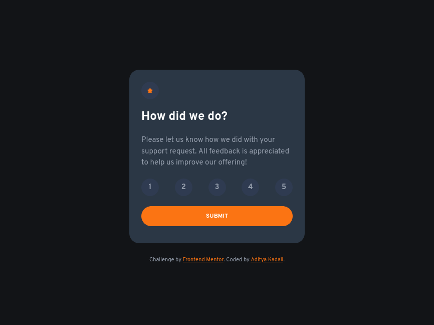
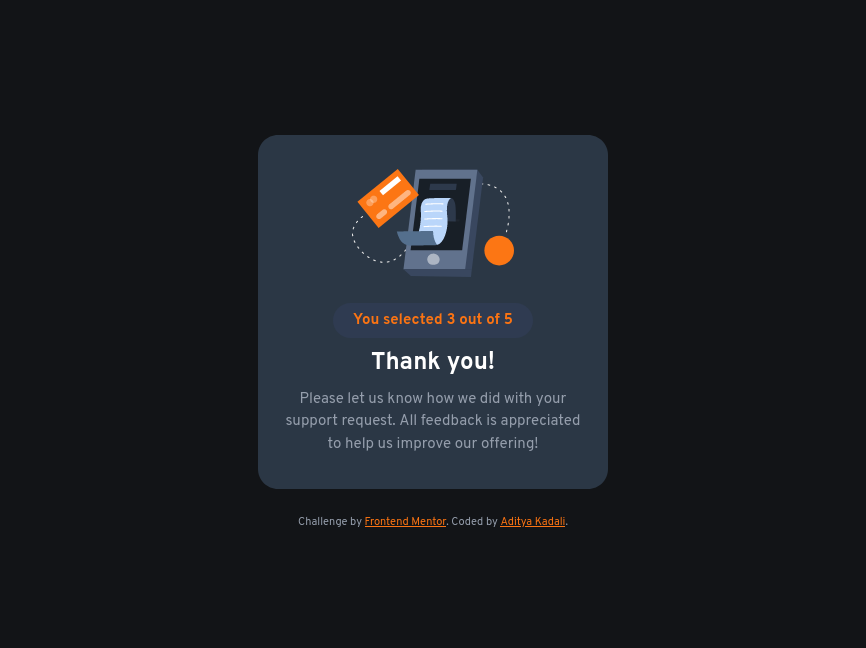

# Frontend Mentor - Interactive rating component solution

This is a solution to the [Interactive rating component challenge on Frontend Mentor](https://www.frontendmentor.io/challenges/interactive-rating-component-koxpeBUmI).

### Screenshot

### Links

- [Solution](https://github.com/Adityakadali/Interactive-rating-component)
- [live URL](https://adityakadali.github.io/Interactive-rating-component/)

## My process

I have started creating mobile layout first and added two html card components
1. [rating card component](./index.html)
2. [Thankyou card componet](./thankyou.html)

Then I went writing JavaScript and added event listeners to update card component with thankyou card componen.

### Built with

- Semantic HTML5 markup
- CSS custom properties
- Flexbox
- JavaScript

## Author
- Aditya Kadali
- Twitter - [@adityakadali](https://www.twitter.com/adityakadali)

**Note: Delete this note and add/remove/edit lines above based on what links you'd like to share.**

